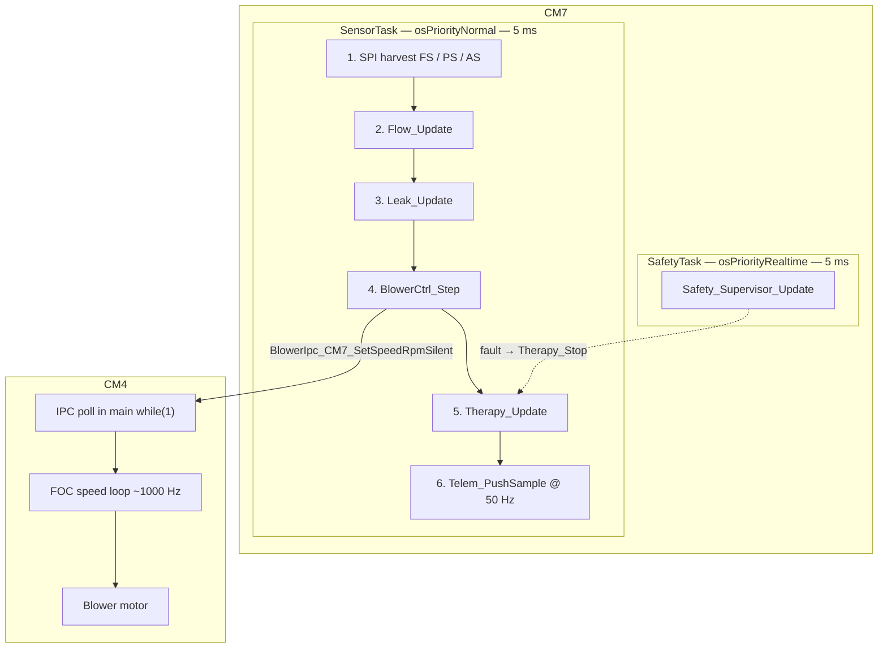
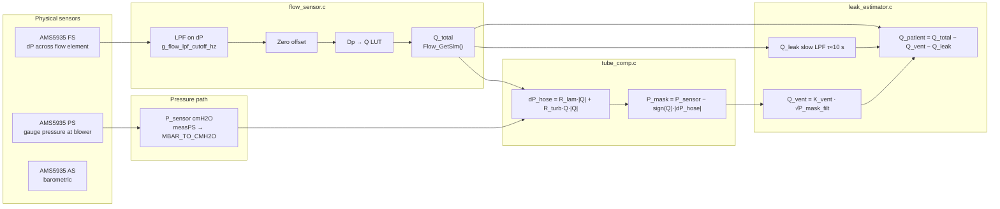
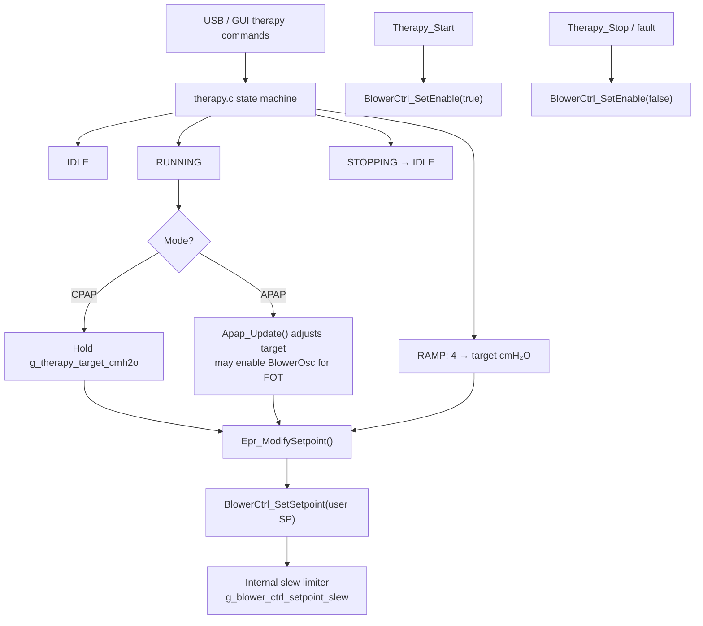
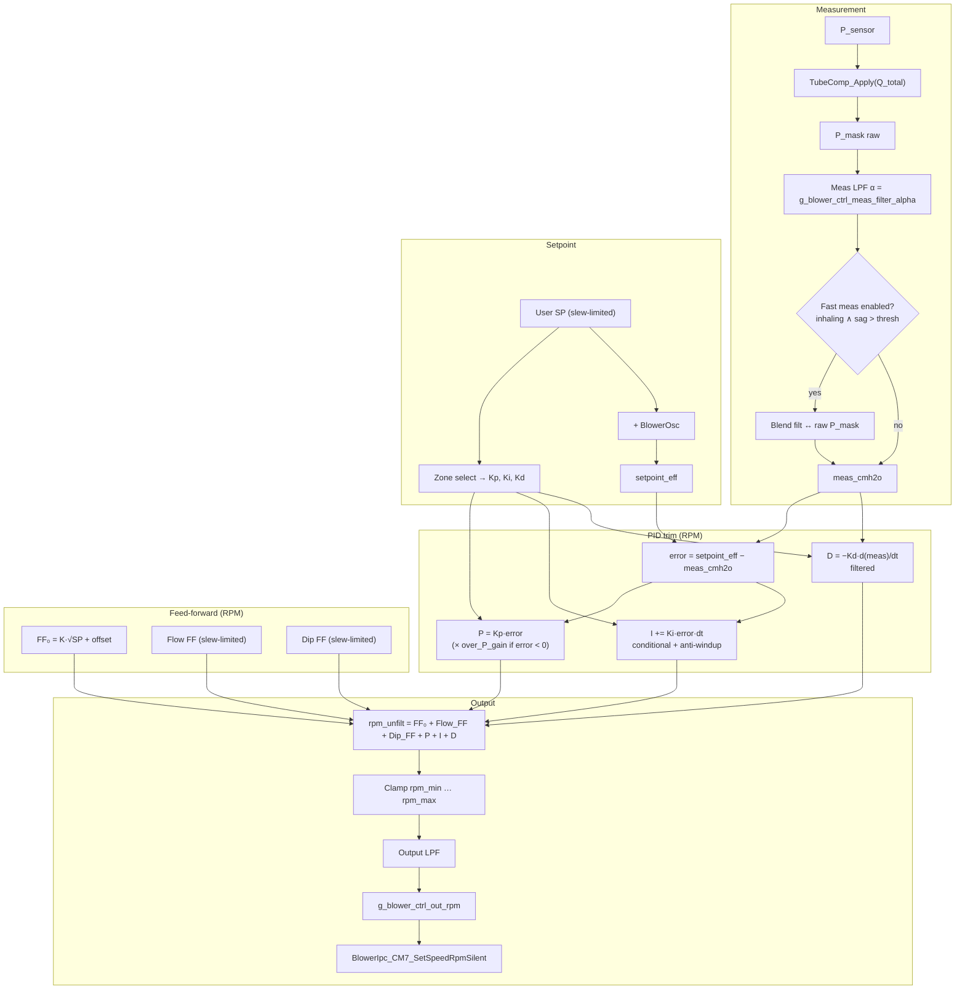
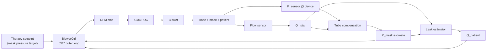
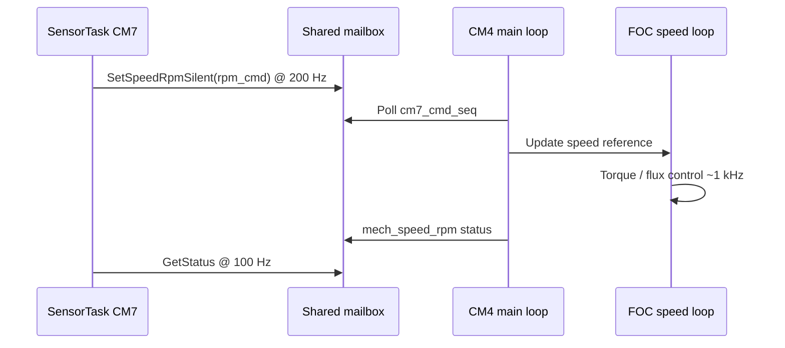

# CPAP Therapy Pressure Control — Block Diagram Reference

**Document:** Pressure control as-built (code reference)  
**Firmware repo:** `CPAP_InitialCode`  
**Primary sources:** `CM7/Core/Src/main.c`, `blower_ctrl.c`, `tube_comp.c`, `flow_sensor.c`, `leak_estimator.c`, `therapy.c`  
**Version:** 1.0  
**Date:** 2025-06-25  

> **Print / PDF:** Open this file in VS Code, Cursor, or GitHub and use **Print to PDF**, or export with Pandoc. Mermaid diagrams render in GitHub and many Markdown previewers; for offline PDF with diagrams, use a Mermaid-capable exporter (e.g. [mermaid.live](https://mermaid.live) paste-export).

---

## Table of contents

1. [Executive summary](#1-executive-summary)
2. [Task architecture and rates](#2-task-architecture-and-rates)
3. [Sensor measurement chain](#3-sensor-measurement-chain)
4. [Therapy setpoint path](#4-therapy-setpoint-path)
5. [Outer pressure controller (`BlowerCtrl_Step`)](#5-outer-pressure-controller-blowerctrl_step)
6. [Feed-forward blocks](#6-feed-forward-blocks)
7. [Closed-loop plant view](#7-closed-loop-plant-view)
8. [CM4 actuator path](#8-cm4-actuator-path)
9. [Safety and parallel logic](#9-safety-and-parallel-logic)
10. [USB telemetry mapping](#10-usb-telemetry-mapping)
11. [Debugger watch symbols](#11-debugger-watch-symbols)
12. [Mode exceptions](#12-mode-exceptions)

---

## 1. Executive summary

Therapy pressure control runs on **CM7** in `SensorTask` at **200 Hz** (5 ms period). Each tick:

1. Harvest SPI sensor samples (flow @ 200 Hz, pressure @ ~190 Hz).
2. Convert flow differential pressure → **total flow** `Q_total`.
3. Estimate **mask pressure** `P_mask` from `P_sensor` and `Q_total` (tube compensation).
4. Update **leak estimator** → **patient flow** `Q_patient`.
5. Run **outer PID + feed-forward** → post **RPM command** to CM4.
6. Run **therapy state machine** (ramp, EPR, APAP, mask-off).

The PID **feedback** is the **estimated mask pressure** (`BlowerCtrl_GetMeasured()`), not the raw blower sensor, when tube compensation is enabled. Feed-forward terms (steady-state, flow, dip) add proactive RPM on top of the PID trim.

---

## 2. Task architecture and rates

### 2.1 RTOS tasks (pressure-relevant)



### 2.2 Sample and control rates

| Block | Rate | Notes |
|-------|------|-------|
| `SensorTask` loop | **200 Hz** | `period_ms = 5` in `main.c` |
| Flow sensor AMS5935 (FS) | **200 Hz** | SPI2, every tick |
| Pressure sensor AMS5935 (PS) | **~190 Hz** | SPI4; 1/20 ticks used for AS |
| Atmospheric AMS5935 (AS) | **10 Hz** | `AS_DECIMATE = 20` |
| CM4 IPC status read | **100 Hz** | `IPC_DECIMATE = 2` |
| `BlowerCtrl_Step` | **200 Hz** | Same as SensorTask |
| RPM command to CM4 | **200 Hz** | `SetSpeedRpmSilent`, `ramp_ms = 0` |
| USB telemetry `T,...` | **50 Hz** | `tick_n % 4 == 0` |
| CM4 FOC inner loop | **~1000 Hz** | Motor speed regulation |

### 2.3 `SensorTask` tick order (code order)

```
Harvest FS → Harvest PS or AS → Start next conversions
    → Leak_Update(Q_total, P_mask_est)
    → BlowerCtrl_Step(dt)
    → Therapy_Update(dt)
    → Telem_PushSample (every 4th tick)
```

---

## 3. Sensor measurement chain

### 3.1 Hardware → software signals



### 3.2 Signal definitions

| Symbol | API | Definition |
|--------|-----|------------|
| `P_sensor` | `BlowerCtrl_GetSensorCmh2o()` | Raw AMS5935 PS at device (cmH₂O) |
| `Q_total` | `Flow_GetSlm()` | Total hose flow from FS (slm) |
| `P_mask` | `BlowerCtrl_GetMeasured()` | Tube-compensated mask estimate (cmH₂O) |
| `Q_patient` | `Flow_GetPatientSlm()` | Total − vent − unintentional leak (filtered) |
| `Q_patient_raw` | `Flow_GetPatientRawSlm()` | Unfiltered patient residual (for fast FF) |

### 3.3 Tube compensation model

```
dP_hose(Q) = R_lam · |Q| + R_turb · Q · |Q|     [cmH₂O]
P_mask     = P_sensor − sign(Q) · |dP_hose|
```

- **Q > 0** (inspiration toward patient): `P_mask < P_sensor`
- **Q < 0** (expiration): `P_mask > P_sensor`
- Defaults: `g_tubecomp_enabled = 1`, `R_turb = 0.00015`, `R_lam = 0`
- If disabled: `P_mask = P_sensor` (pass-through)

### 3.4 What uses which signal

| Consumer | Pressure | Flow |
|----------|----------|------|
| PID feedback | `P_mask` (est.) | `Q_total` (tube comp only) |
| Flow FF | — | `Q_patient` (max raw/filt in inhale dir.) |
| Dip FF | `P_sensor` drop rate + `P_mask` sag | inhale gate via `Q_patient` |
| Leak / mask-off | `P_mask` | `Q_total` |
| EPR breath detect | `P_mask` | `Q_patient` |
| Safety supervisor | `P_sensor` | RPM, setpoint band |
| USB plot `P_sensor` | raw sensor | — |
| USB plot `P_mask` | mask estimate | — |

---

## 4. Therapy setpoint path

`Therapy_Update()` runs **after** `BlowerCtrl_Step()` each tick but setpoint changes apply on the **next** tick via `BlowerCtrl_SetSetpoint()`.



### 4.1 Effective PID setpoint (inside `BlowerCtrl_Step`)

```
setpoint_eff = g_blower_ctrl_setpoint_slew + BlowerOsc_sample
```

- **Slew limiter** ramps user setpoint at `g_blower_ctrl_slew_cmh2o_per_s` (separate up-rate available).
- **BlowerOsc** adds sinusoidal perturbation (default off; used for APAP/FOT).
- **Gain scheduling** uses **slewed** setpoint (without oscillation) to pick LOW / MID / HIGH `Kp, Ki, Kd`.

---

## 5. Outer pressure controller (`BlowerCtrl_Step`)

### 5.1 Block diagram



### 5.2 PID term summary

| Term | Equation / rule |
|------|-----------------|
| Error | `setpoint_eff − meas_cmh2o` |
| P | `Kp · error`; if `error < −over_p_thresh` → `× over_p_gain` |
| I | `Ki · error · dt`; frozen while setpoint still slewing up at start; conditional integration when saturated |
| D | `−Kd · d(meas)/dt` (D-on-measurement, LPF on derivative) |
| Anti-windup | Reject I step if deepening saturation; clamp I to RPM headroom after FF |

### 5.3 Gain zones (scheduled on slew setpoint)

| Zone | Setpoint range (cmH₂O) | Typical use |
|------|------------------------|-------------|
| LOW | 4 – 8 | Steep blower gain → lower Kp/Ki |
| MID | 8 – 15 | Transition |
| HIGH | 15 – 25 | Higher Kp/Ki for fine control |

Hysteresis: `BLOWER_CTRL_ZONE_HYST_CMH2O = 0.5`

---

## 6. Feed-forward blocks

### 6.1 Steady-state FF (`g_blower_ctrl_ff_enable`)

```
FF₀ = g_blower_ctrl_ff_k_rpm_per_sqrtcmh · √(setpoint) + g_blower_ctrl_ff_offset_rpm
```

Carries most of the DC RPM so the integrator acts as a small trim (default `integ_max` ~4 krpm with FF on).

### 6.2 Flow FF (`g_blower_ctrl_flow_ff_enable`)

**Inputs**

- `q_pat = inhalePatientFlowSlm()` → `max(Q_patient_raw, Q_patient_filt)` in inhale direction
- `dq/dt` from successive `q_pat` samples
- Gated by `patientInhaling()` (above deadband)

**Target (positive inhale sign)**

```
if q_pat > deadband:
    ff_target = k · (q_pat − deadband)
if dQ/dt > onset_thresh:
    ff_target += onset_k · (dQ/dt − onset_thresh)   [capped]
```

Slew-limited to `s_ff_flow_slew_rpm` using `flow_ff_rise_rpm_per_s` / `flow_ff_fall_rpm_per_s`.

### 6.3 Dip FF (`g_blower_ctrl_dip_ff_enable`)

Anticipates pressure sag from **fast drop of P_sensor** during inhalation.

**Gates (all required)**

1. `patientInhaling()`
2. `setpoint − P_mask > dip_ff_err_min`
3. `dP_sensor/dt < −dip_ff_thresh` (filtered drop rate)

```
ff_dip_target = dip_k · (−dP_sensor/dt − thresh)   [capped at dip_ff_max_rpm]
```

Slew-limited separately; **zero on expiration** by design.

### 6.4 Combined disturbance FF

```
ff_dist = ff_flow + ff_dip
rpm_unfilt = FF₀ + ff_dist + P + I + D
```

---

## 7. Closed-loop plant view



**Important:** There is no sensor at the mask. Mask pressure is **estimated**; patient flow is **derived** from total flow minus vent and leak models.

---

## 8. CM4 actuator path



| Signal | Direction | Content |
|--------|-----------|---------|
| `cm7_cmd_seq` | CM7 → CM4 | New RPM command flag |
| `target_speed_rpm` | CM7 → CM4 | PID output |
| `mech_speed_rpm` | CM4 → CM7 | Measured motor speed (telemetry) |

---

## 9. Safety and parallel logic

`SafetyTask` runs at 5 ms with **higher priority** than `SensorTask`. It does **not** compute PID; it monitors and can stop therapy.

| Check | Input | Action |
|-------|-------|--------|
| Sensor range | `P_sensor` | Fault if implausible |
| Low pressure + high RPM | `P_sensor`, `rpm_cmd` | Hose disconnect suspicion |
| Over-pressure band | `P_sensor` vs target | Fault if exceeded |
| CM4 heartbeat | IPC status age | Fault if CM4 unresponsive |

**Mask-off** (`therapy.c`): high unintentional leak → reduced RPM hold; uses `Leak_GetInstantExcessSlm()` and `Leak_IsHigh()`.

**EPR** (`epr.c`): modifies expiratory setpoint; uses `Q_patient` + `P_mask` for phase.

**APAP** (`apap_ctrl.c`): adjusts session target; may enable `BlowerOsc` for forced-oscillation probing.

---

## 10. USB telemetry mapping

Wire format (50 Hz):

```
T,<ms>,<P_sensor>,<Q_patient>,<pid_rpm_cmd>,<mech_rpm>,<P_mask>
```

| Field | Firmware source |
|-------|-----------------|
| `P_sensor` | `BlowerCtrl_GetSensorCmh2o()` |
| `Q_patient` | `Flow_GetPatientSlm()` |
| `pid_rpm_cmd` | `BlowerCtrl_GetOutputRpm()` |
| `mech_rpm` | `g_blower_status.mech_speed_rpm` |
| `P_mask` | `BlowerCtrl_GetMeasured()` |

Python plotter: `pc_tools/cpap_telemetry_plot.py` — blue `P_sensor`, teal `P_mask (est.)` on same axes.

---

## 11. Debugger watch symbols

### 11.1 Pressure and flow

| Symbol | Meaning |
|--------|---------|
| `g_blower_ctrl_sensor_cmh2o` | Raw `P_sensor` |
| `g_blower_ctrl_meas_cmh2o` | `P_mask` estimate (PID measurement) |
| `g_blower_ctrl_meas_filt_cmh2o` | LPF’d measurement |
| `g_blower_ctrl_error_cmh2o` | `setpoint_eff − meas` |
| `g_tubecomp_drop_cmh2o` | Computed hose drop |
| `g_tubecomp_p_mask_cmh2o` | Last tube-comp mask value |
| `g_flow_q_slm` | `Q_total` |
| `g_flow_patient_slm` | `Q_patient` (leak module) |
| `g_leak_uninten_slm` | Slow unintentional leak estimate |

### 11.2 PID and FF terms (RPM)

| Symbol | Meaning |
|--------|---------|
| `g_blower_ctrl_ff_term` | Steady-state FF₀ |
| `g_blower_ctrl_ff_flow_term` | Flow FF (after slew) |
| `g_blower_ctrl_ff_dip_term` | Dip FF (after slew) |
| `g_blower_ctrl_p_term` | P contribution |
| `g_blower_ctrl_i_term` | Integrator state |
| `g_blower_ctrl_d_term` | D contribution |
| `g_blower_ctrl_out_rpm` | Final RPM command |
| `g_blower_ctrl_saturated` | Non-zero if clamped |

### 11.3 Setpoint and mode

| Symbol | Meaning |
|--------|---------|
| `g_blower_ctrl_setpoint_user` | User / therapy target |
| `g_blower_ctrl_setpoint_slew` | Slewed internal setpoint |
| `g_blower_ctrl_zone` | Active gain zone (0=LOW, 1=MID, 2=HIGH) |
| `g_blower_ctrl_enabled` | Master PID enable |
| `g_tubecomp_enabled` | Tube compensation on/off |
| `g_blower_ctrl_wm6850_mode` | Reference mode bypass |

---

## 12. Mode exceptions

| Condition | Behaviour |
|-----------|-----------|
| `g_tubecomp_enabled = 0` | `P_mask = P_sensor`; PID regulates blower-side pressure |
| `g_blower_ctrl_wm6850_mode = 1` | Raw sensor PID @ **100 Hz**; FF, slew zones, tube comp, oscillation bypassed on PID path |
| `g_blower_ctrl_enabled = 0` | No RPM posts from PID; measurement tracking only |
| `g_blower_ctrl_pid_enable = 0` | Output = FF terms only (no P/I/D) |
| Manual bench mode | `BlowerCtrl_ManualStart/SetSpeed` bypasses pressure PID |

---

## Appendix A — One-page ASCII overview (print-friendly)

```
┌─────────────────────────────────────────────────────────────────────────────┐
│                        THERAPY SETPOINT (therapy.c)                          │
│   CPAP target / APAP adjust ──► EPR ──► BlowerCtrl_SetSetpoint ──► slew   │
└───────────────────────────────────┬─────────────────────────────────────────┘
                                    │ setpoint_eff = slew + BlowerOsc
                                    ▼
┌──────────┐   ┌────────────┐   ┌──────────────┐   ┌─────────────────────────┐
│ AMS5935  │   │ Flow_Update│   │ Leak_Update  │   │    BlowerCtrl_Step      │
│ PS → P_s │   │ FS → Q_tot │   │ → Q_patient  │   │  P_mask = TubeComp()  │
└────┬─────┘   └─────┬──────┘   └──────┬───────┘   │  PID(P,I,D) + FF₀     │
     │               │                  │           │  + Flow_FF + Dip_FF     │
     └───────────────┴──────────────────┴──────────►│  → RPM cmd @ 200 Hz    │
                                                    └───────────┬─────────────┘
                                                                │
                                                    ┌───────────▼─────────────┐
                                                    │ CM4 FOC → Blower → Hose │
                                                    └─────────────────────────┘
```

---

## Appendix B — Related files

| File | Role |
|------|------|
| `CM7/Core/Src/main.c` | `SensorTask`, sensor scheduling, call order |
| `CM7/Core/Src/blower_ctrl.c` | Outer PID + all FF + RPM output |
| `CM7/Core/Src/tube_comp.c` | Mask pressure estimate |
| `CM7/Core/Src/flow_sensor.c` | FS conditioning, `Q_total` |
| `CM7/Core/Src/leak_estimator.c` | Vent/leak model, `Q_patient` |
| `CM7/Core/Src/therapy.c` | Therapy SM, setpoint, start/stop |
| `CM7/Core/Src/apap_ctrl.c` | APAP target + FOT oscillation |
| `CM7/Core/Src/blower_osc.c` | Sinusoidal setpoint perturbation |
| `CM7/Core/Src/safety_supervisor.c` | Fault detection |
| `CM7/Core/Src/telemetry_stream.c` | USB `T,...` lines |
| `pc_tools/cpap_telemetry_plot.py` | Live plots |

---

*End of document*
